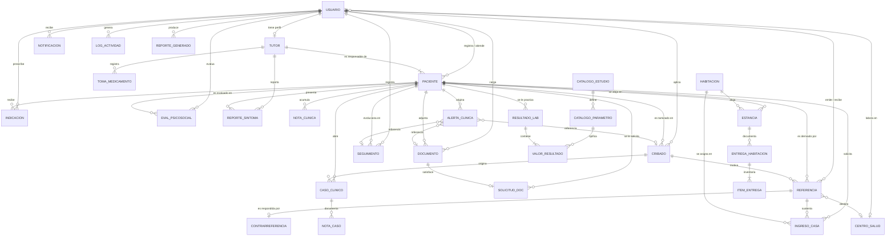
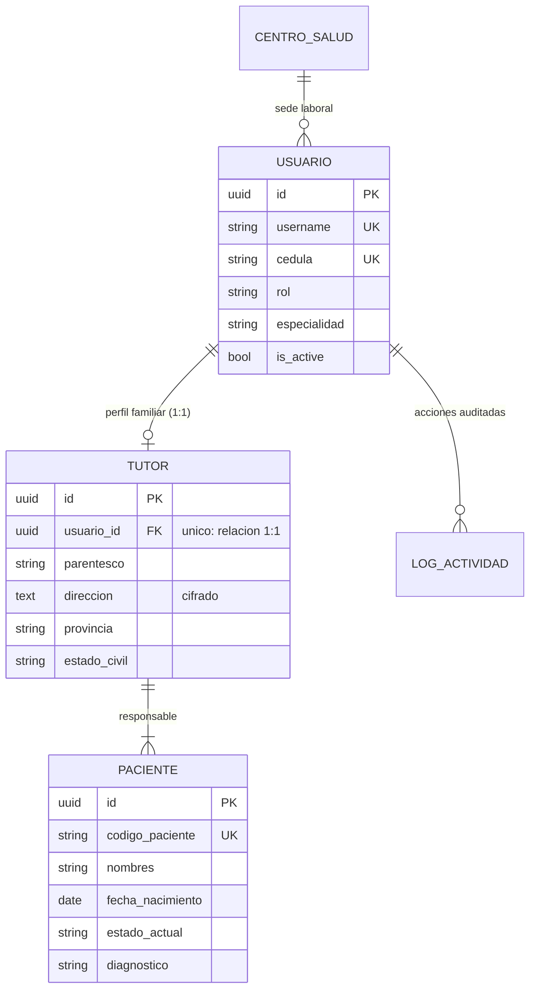
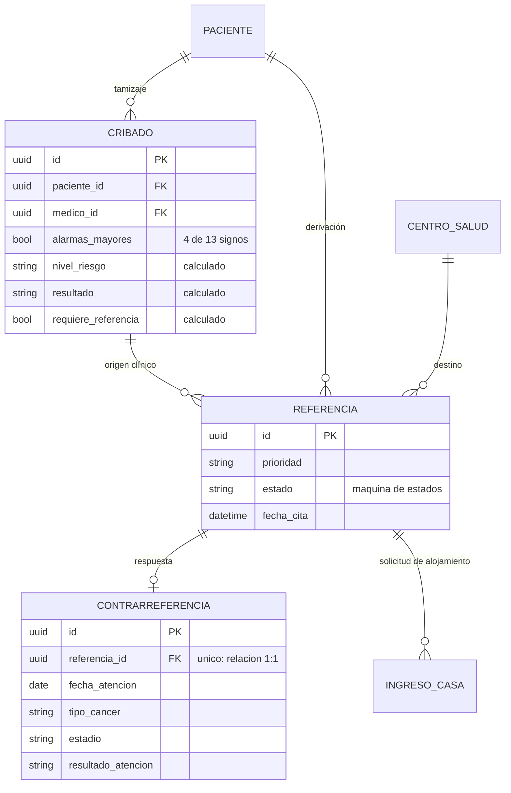
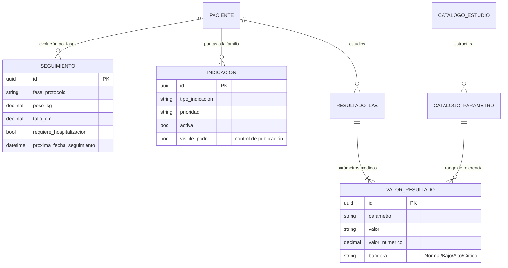
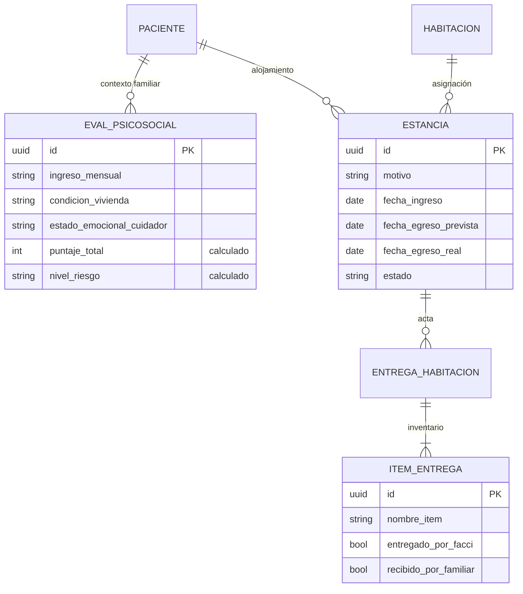
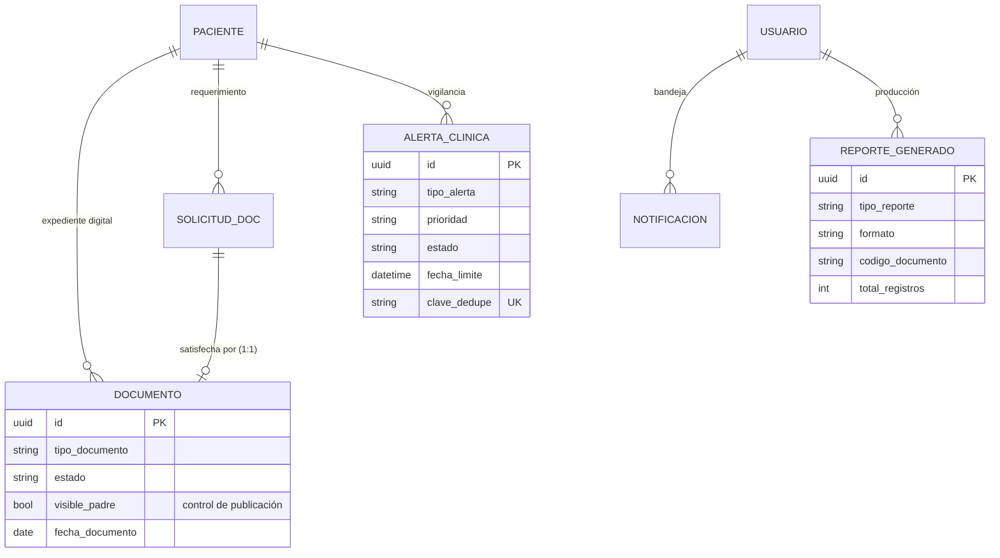

# Modelo de Datos (Diagrama de Datos) — FACCI Care

**Sistema de Detección Temprana de Cáncer Pediátrico**
Fundación de Apoyo Contra el Cáncer Infantil (FACCI) — República Dominicana

| Campo | Detalle |
|---|---|
| **Tipo de entregable** | Modelo de datos — nivel conceptual y lógico |
| **Versión del documento** | 1.0 |
| **Fecha de emisión** | Agosto 2026 |
| **Fuente** | Modelos Django de `apps/*/models.py`, verificados contra el esquema generado por las migraciones |
| **Documentos relacionados** | `04-Diagrama-de-Base-de-Datos.md` (nivel físico) · `05-Diccionario-Fisico-BD.md` (diccionario) |

---

## Tabla de contenido

1. [Propósito y alcance](#1-propósito-y-alcance)
2. [Niveles del modelo](#2-niveles-del-modelo)
3. [Resumen cuantitativo](#3-resumen-cuantitativo)
4. [Modelo conceptual](#4-modelo-conceptual)
5. [Diagrama entidad-relación global](#5-diagrama-entidad-relación-global)
6. [Diagramas por subsistema](#6-diagramas-por-subsistema)
7. [Catálogo de entidades](#7-catálogo-de-entidades)
8. [Catálogo de relaciones](#8-catálogo-de-relaciones)
9. [Dominios y catálogos de valores](#9-dominios-y-catálogos-de-valores)
10. [Atributos derivados y calculados](#10-atributos-derivados-y-calculados)
11. [Reglas de integridad](#11-reglas-de-integridad)
12. [Normalización](#12-normalización)
13. [Decisiones de diseño](#13-decisiones-de-diseño)
14. [Trazabilidad modelo ↔ proceso de negocio](#14-trazabilidad-modelo--proceso-de-negocio)

---

## 1. Propósito y alcance

Este documento describe **qué información almacena FACCI Care y cómo se relaciona entre sí**, con independencia del motor de base de datos. Es el documento de referencia para entender el negocio desde los datos: qué entidades existen, qué representa cada una, con qué cardinalidad se vinculan y qué reglas gobiernan su integridad.

No describe tipos de columna ni índices; eso corresponde a los documentos de nivel físico:

| Nivel | Pregunta que responde | Documento |
|---|---|---|
| **Conceptual** | ¿Qué entidades del negocio existen y cómo se relacionan? | Este documento, secciones 4–8 |
| **Lógico** | ¿Qué atributos tiene cada entidad, con qué dominios y reglas? | Este documento, secciones 7–12 |
| **Físico** | ¿Cómo se implementa en tablas, columnas, tipos, claves e índices? | `04-Diagrama-de-Base-de-Datos.md` y `05-Diccionario-Fisico-BD.md` |

---

## 2. Niveles del modelo

```
┌──────────────────────────────────────────────────────────────┐
│  CONCEPTUAL   Entidades del negocio y sus relaciones          │
│               Paciente · Tutor · Cribado · Referencia · …     │
└────────────────────────────┬─────────────────────────────────┘
                             │ refinamiento
┌────────────────────────────▼─────────────────────────────────┐
│  LÓGICO       Atributos, dominios, claves y cardinalidades    │
│               (independiente del motor de base de datos)      │
└────────────────────────────┬─────────────────────────────────┘
                             │ implementación (ORM Django)
┌────────────────────────────▼─────────────────────────────────┐
│  FÍSICO       32 tablas propias + 9 del framework             │
│               SQLite (desarrollo) / MySQL (producción)        │
└──────────────────────────────────────────────────────────────┘
```

---

## 3. Resumen cuantitativo

| Métrica | Valor |
|---|---|
| Entidades propias del sistema | **32** |
| Tablas del framework Django (auth, admin, sesiones, tipos de contenido, migraciones) | 9 |
| Atributos totales en entidades propias | **463** |
| Relaciones (claves foráneas) | **68** |
| Relaciones uno a uno | 3 |
| Entidades con identificador UUID | 29 |
| Entidades con identificador entero autoincremental | 3 |
| Índices definidos | 182 |
| Restricciones de unicidad simple | 11 |
| Restricciones de unicidad compuesta | 1 |
| Atributos cifrados en reposo | 7 |
| Módulos funcionales | 15 |

---

## 4. Modelo conceptual

### 4.1 Entidades centrales

El modelo gira alrededor de tres ejes:

```
                        ┌──────────────┐
                        │   USUARIO    │  Quién actúa en el sistema
                        │  (8 roles)   │  y bajo qué autorización
                        └──────┬───────┘
                               │ registra / atiende / evalúa
                               ▼
   ┌───────────┐        ┌──────────────┐        ┌────────────────┐
   │   TUTOR   │───1:N──│   PACIENTE   │──1:N───│  ACTO CLÍNICO  │
   │ (familia) │        │  (el caso)   │        │ cribado, refe- │
   └───────────┘        └──────────────┘        │ rencia, segui- │
                               │                │ miento, labora-│
                               │                │ torio, docs…   │
                               ▼                └────────────────┘
                        ┌──────────────┐
                        │ ACOMPAÑAMIEN-│  Psicosocial, Casa FACCI,
                        │ TO Y APOYO   │  recursos educativos
                        └──────────────┘
```

- **Usuario** — toda persona que opera el sistema. Su rol determina qué puede ver y hacer.
- **Paciente** — el eje del modelo. Casi todas las entidades clínicas cuelgan de él.
- **Tutor** — la familia responsable. Es obligatorio: **no existe paciente sin tutor**.
- **Acto clínico** — cualquier hecho registrado sobre el paciente, siempre con autor y fecha.
- **Acompañamiento** — la dimensión social del caso: evaluación psicosocial y alojamiento.

### 4.2 Agrupación por subsistemas

| Subsistema | Entidades | Propósito |
|---|---|---|
| **Seguridad** | Usuario | Identidad, rol y autorización |
| **Núcleo** | Centro de salud, Log de actividad, Configuración del sistema | Catálogos institucionales, auditoría y parámetros |
| **Familia** | Tutor, Reporte de síntoma, Recurso educativo, Registro de toma de medicamento | Portal de padres y participación de la familia |
| **Paciente** | Paciente, Nota clínica | Identificación y expediente |
| **Detección** | Cuestionario de cribado | Tamizaje estandarizado |
| **Derivación** | Referencia médica, Contrarreferencia, Referencia de ingreso a Casa FACCI | Ruta entre niveles de atención |
| **Tratamiento** | Seguimiento de paciente, Indicación médica | Evolución y pautas a la familia |
| **Caso oncológico** | Caso clínico, Nota de caso | Caso confirmado y su evolución |
| **Laboratorio** | Catálogo de estudio, Catálogo de parámetro, Resultado de laboratorio, Valor de resultado | Apoyo diagnóstico |
| **Psicosocial** | Evaluación psicosocial | Contexto familiar y riesgo social |
| **Alojamiento** | Habitación, Estancia familiar, Entrega de habitación, Ítem de entrega | Casa FACCI |
| **Documental** | Documento médico, Solicitud de documento | Expediente digital |
| **Analítica** | Reporte generado | Trazabilidad de la reportería |
| **Comunicación** | Notificación, Alerta clínica | Avisos internos y vigilancia activa |

---

## 5. Diagrama entidad-relación global

> El diagrama usa notación *crow's foot*: `||` uno obligatorio · `o|` cero o uno · `|{` uno o muchos · `o{` cero o muchos.



### 5.1 Vista simplificada de la ruta clínica

```
  TUTOR ──1:N──► PACIENTE
                    │
                    ├──1:N──► CRIBADO ──0:N──► REFERENCIA ──0:1──► CONTRARREFERENCIA
                    │                              │
                    │                              └──0:N──► INGRESO CASA FACCI
                    │
                    ├──1:N──► SEGUIMIENTO ──────► (deriva) ──► INDICACIÓN ──► visible al TUTOR
                    │
                    ├──1:N──► RESULTADO LAB ──1:N──► VALOR RESULTADO
                    ├──1:N──► DOCUMENTO ◄──0:1── SOLICITUD DE DOCUMENTO
                    ├──1:N──► EVALUACIÓN PSICOSOCIAL
                    ├──1:N──► ESTANCIA ──1:N──► ENTREGA ──1:N──► ÍTEM
                    ├──1:N──► REPORTE DE SÍNTOMA  ◄── lo crea el TUTOR
                    └──1:N──► ALERTA CLÍNICA      ◄── la genera el sistema
```

---

## 6. Diagramas por subsistema

### 6.1 Seguridad y familia



**Regla clave:** la relación Usuario–Tutor es **1:1**. Una cuenta del sistema representa a un tutor y solo a uno; a su vez, un tutor puede tener **varios pacientes** a cargo (hermanos).

### 6.2 Detección y derivación



**Regla clave:** la Contrarreferencia es **0:1** respecto de la Referencia. Una referencia recibe **como máximo una** respuesta formal del especialista.

### 6.3 Tratamiento y laboratorio



**Regla clave:** el catálogo de laboratorio (`CATALOGO_ESTUDIO` → `CATALOGO_PARAMETRO`) es **maestro**: define los rangos de referencia contra los que se calcula la bandera de cada valor medido.

### 6.4 Acompañamiento y Casa FACCI



### 6.5 Documental, comunicación y analítica



**Regla clave:** la Alerta Clínica es una entidad **polimórfica por composición**: además del paciente, referencia opcionalmente el cribado, la referencia, el seguimiento, el documento o la solicitud que la originó. Todos esos vínculos son opcionales y se anulan si el origen desaparece.

---

## 7. Catálogo de entidades

### 7.1 Subsistema Seguridad y Núcleo

| Entidad | Descripción | Identificador | Atributos principales |
|---|---|---|---|
| **Usuario** | Persona que opera el sistema, con rol y autorización | UUID | Usuario, correo, cédula, rol, especialidad, centro médico, teléfono (cifrado), foto, estado activo |
| **Centro de salud** | Hospital, clínica, UNAP o centro diagnóstico | Entero | Nombre, tipo por nivel, provincia, municipio, dirección, contacto, camas oncológicas, especialidades, personal entrenado, estado de derivación, coordenadas |
| **Log de actividad** | Bitácora de auditoría | Entero | Usuario, acción, tipo, módulo, objeto afectado, descripción, IP, fecha |
| **Configuración del sistema** | Parámetros institucionales (registro único) | Entero | Nombre de la aplicación, nombre de la institución, logo de aplicación, logo de reportes |

### 7.2 Subsistema Familia

| Entidad | Descripción | Identificador | Atributos principales |
|---|---|---|---|
| **Tutor** | Perfil del padre, madre o tutor responsable | UUID | Usuario (1:1), parentesco, nacionalidad, dirección (cifrada), provincia, municipio, ocupación, contacto y teléfono de emergencia (cifrados), estado civil, cantidad de hijos, ingresos |
| **Reporte de síntoma** | Síntomas observados y reportados por la familia | UUID | Paciente, tutor, fecha de inicio, gravedad, lista de síntomas, descripción |
| **Recurso educativo** | Material formativo del portal de padres | UUID | Título, identificador URL, categoría, descripción, contenido, actividades, pasos para el tutor, cuándo contactar, icono, imagen, video, orden, activo |
| **Registro de toma de medicamento** | Marca diaria de medicamento administrado | UUID | Paciente, tutor, nombre del medicamento, índice, fecha, hora de marcado |

### 7.3 Subsistema Clínico

| Entidad | Descripción | Identificador | Atributos principales |
|---|---|---|---|
| **Paciente** | Menor bajo vigilancia o tratamiento | UUID | Código, nombres, apellidos, nacimiento, sexo, tipo de sangre, peso, altura, dirección/alergias/antecedentes (cifrados), provincia, municipio, escuela, seguro, estado actual, diagnóstico, fotografía, tutor, médico asignado, creador |
| **Nota clínica** | Anotación libre en el expediente | UUID | Paciente, autor, tipo, texto, marca de importante |
| **Cuestionario de cribado** | Tamizaje de detección temprana | UUID | Paciente, médico, 13 signos booleanos, tipo de cáncer sospechado, observaciones, nivel de riesgo, resultado, requiere referencia |
| **Referencia médica** | Derivación formal a especialista o centro | UUID | Paciente, cribado de origen, médico referente, especialista destino, hospital destino, motivo, prioridad, estado, fecha de cita, observaciones |
| **Contrarreferencia** | Respuesta del especialista al referente | UUID | Referencia (1:1), médico contrarreferente, fecha de atención, diagnóstico, tipo de cáncer, estadio, tratamiento, estudios, medicamentos, resultado, recomendaciones, próxima cita |
| **Referencia de ingreso a Casa FACCI** | Solicitud formal de alojamiento | UUID | Paciente, referencia médica, centro de origen, hospital destino, motivo, fechas, habitación, datos del responsable, estado |
| **Seguimiento de paciente** | Consulta de evolución por fase de protocolo | UUID | Paciente, médico tratante, fase, estado clínico, síntomas, tratamiento, medicamentos, peso, talla, próxima cita, lugar, requiere hospitalización |
| **Indicación médica** | Pauta dirigida a la familia | UUID | Paciente, médico, tipo, título, descripción, prioridad, activa, visible para el tutor |
| **Caso clínico** | Caso oncológico confirmado | UUID | Código, paciente, médico responsable, cribado de origen, tipo de cáncer, protocolo, estado, fechas |
| **Nota de caso** | Evolución del caso oncológico | UUID | Caso, autor, contenido, fecha |

### 7.4 Subsistema Laboratorio

| Entidad | Descripción | Identificador | Atributos principales |
|---|---|---|---|
| **Catálogo de estudio** | Maestro de estudios disponibles | UUID | Nombre (único), categoría, descripción, activo |
| **Catálogo de parámetro** | Parámetro medible de un estudio | UUID | Estudio, nombre, unidad, referencia mínima/máxima/textual, tipo de valor, alerta crítica, comentario sugerido, orden |
| **Resultado de laboratorio** | Estudio practicado a un paciente | UUID | Paciente, solicitante, revisor, tipo, nombre del examen, fechas, estado, resultado narrativo, archivo, valores críticos |
| **Valor de resultado** | Medición individual dentro de un resultado | UUID | Resultado, parámetro del catálogo, parámetro, valor, valor numérico, unidad, rangos, comentario, bandera |

### 7.5 Subsistema Acompañamiento

| Entidad | Descripción | Identificador | Atributos principales |
|---|---|---|---|
| **Evaluación psicosocial** | Diagnóstico del contexto familiar | UUID | Paciente, evaluador, cuidador, hogar, vivienda, ingresos, seguro, dificultades, apoyo familiar, estado emocional, situación escolar, puntaje, nivel de riesgo, necesidades, acciones, próxima evaluación |
| **Habitación** | Espacio físico de la Casa FACCI | UUID | Nombre/número, capacidad, descripción, habilitada |
| **Estancia familiar** | Período de alojamiento de una familia | UUID | Paciente, habitación, acompañante, motivo, fecha de ingreso, egreso previsto, egreso real, estado, registrada por |
| **Entrega de habitación** | Acta de entrega y recepción | UUID | Estancia, fecha, horas, entregado/recibido por FACCI y por la familia, observaciones |
| **Ítem de entrega** | Línea del inventario del acta | UUID | Entrega, nombre del ítem, entregado, recibido, observación, orden |

### 7.6 Subsistema Documental, Comunicación y Analítica

| Entidad | Descripción | Identificador | Atributos principales |
|---|---|---|---|
| **Documento médico** | Archivo del expediente | UUID | Paciente, subido por, tipo, archivo, descripción, fecha, estado, visible para el tutor |
| **Solicitud de documento** | Requerimiento de documento a la familia | UUID | Paciente, médico solicitante, título, descripción, estado, documento asociado (1:1) |
| **Alerta clínica** | Aviso generado por vigilancia del sistema | UUID | Paciente y origen opcional (cribado, referencia, seguimiento, documento, solicitud), tipo, prioridad, título, descripción, estado, fechas, revisor, comentario de cierre, clave de deduplicación |
| **Notificación** | Aviso dirigido a un usuario | UUID | Usuario, tipo, módulo, prioridad, título, mensaje, leída, URL de acción, objeto relacionado, archivada, clave de deduplicación |
| **Reporte generado** | Registro histórico de reportería | UUID | Generado por, tipo, nombre, formato, código de documento, total de registros, rango de fechas, archivo |

---

## 8. Catálogo de relaciones

### 8.1 Relaciones uno a uno (1:1)

| Entidad A | Entidad B | Significado |
|---|---|---|
| Usuario | Tutor | Un usuario con rol Padre/Tutor tiene exactamente un perfil familiar |
| Referencia médica | Contrarreferencia | Una referencia recibe a lo sumo una respuesta formal |
| Solicitud de documento | Documento médico | Una solicitud se satisface con a lo sumo un documento |

### 8.2 Relaciones uno a muchos (1:N) principales

| Entidad padre | Entidad hija | Cardinalidad | Obligatoria |
|---|---|---|---|
| Tutor | Paciente | 1:N | **Sí** — todo paciente tiene tutor |
| Paciente | Cuestionario de cribado | 1:N | No |
| Paciente | Referencia médica | 1:N | No |
| Paciente | Seguimiento | 1:N | No |
| Paciente | Indicación médica | 1:N | No |
| Paciente | Nota clínica | 1:N | No |
| Paciente | Documento médico | 1:N | No |
| Paciente | Solicitud de documento | 1:N | No |
| Paciente | Resultado de laboratorio | 1:N | No |
| Paciente | Evaluación psicosocial | 1:N | No |
| Paciente | Estancia familiar | 1:N | No |
| Paciente | Reporte de síntoma | 1:N | No |
| Paciente | Alerta clínica | 1:N | No |
| Paciente | Caso clínico | 1:N | No |
| Paciente | Referencia de ingreso a Casa FACCI | 1:N | No |
| Paciente | Registro de toma de medicamento | 1:N | No |
| Cuestionario de cribado | Referencia médica | 1:N | No — la referencia puede no venir de un cribado |
| Cuestionario de cribado | Caso clínico | 1:N | No |
| Referencia médica | Referencia de ingreso a Casa FACCI | 1:N | No |
| Resultado de laboratorio | Valor de resultado | 1:N | **Sí** — un resultado sin valores carece de sentido |
| Catálogo de estudio | Catálogo de parámetro | 1:N | **Sí** |
| Catálogo de parámetro | Valor de resultado | 1:N | No — el valor puede registrarse sin catálogo |
| Habitación | Estancia familiar | 1:N | No |
| Habitación | Referencia de ingreso a Casa FACCI | 1:N | No |
| Estancia familiar | Entrega de habitación | 1:N | No |
| Entrega de habitación | Ítem de entrega | 1:N | **Sí** |
| Caso clínico | Nota de caso | 1:N | No |

### 8.3 Relaciones de autoría y responsabilidad

Estas relaciones vinculan cada hecho registrado con la persona que lo produjo. Son la base de la trazabilidad clínica.

| Entidad | Rol del usuario | Obligatoria |
|---|---|---|
| Paciente | Médico asignado / creado por | No |
| Cuestionario de cribado | Médico evaluador | **Sí** |
| Referencia médica | Médico referente | **Sí** |
| Referencia médica | Especialista destino | No |
| Contrarreferencia | Médico contrarreferente | **Sí** |
| Seguimiento | Médico tratante | **Sí** |
| Seguimiento | Médico del seguimiento agendado | No |
| Indicación médica | Médico prescriptor | **Sí** |
| Nota clínica / Nota de caso | Autor | **Sí** |
| Documento médico | Subido por | **Sí** |
| Solicitud de documento | Médico solicitante | **Sí** |
| Resultado de laboratorio | Solicitado por / revisado por | No |
| Evaluación psicosocial | Evaluador | No |
| Estancia familiar | Registrada por | **Sí** |
| Reporte generado | Generado por | **Sí** |
| Alerta clínica | Revisada por | No |

### 8.4 Relaciones con el catálogo de centros de salud

| Entidad | Atributo | Significado |
|---|---|---|
| Usuario | Centro médico | Sede donde labora |
| Referencia médica | Hospital destino | Centro receptor de la derivación |
| Seguimiento | Lugar del seguimiento | Centro donde se realiza la consulta |
| Referencia de ingreso a Casa FACCI | Centro de origen / Hospital destino | Trayecto del paciente |

---

## 9. Dominios y catálogos de valores

Los siguientes dominios son **cerrados**: el sistema solo admite los valores listados.

### 9.1 Dominios de seguridad

| Dominio | Valores |
|---|---|
| **Rol de usuario** | Administrador · Médico General · Pediatra · Oncólogo · Coordinador FACCI · Trabajo Social / Psicología · Enfermera / Técnico de Salud · Padre / Tutor |
| **Tipo de documento de identidad** | Cédula · Pasaporte |

### 9.2 Dominios del paciente

| Dominio | Valores |
|---|---|
| **Sexo** | Masculino · Femenino |
| **Tipo de sangre** | A+ · A− · B+ · B− · AB+ · AB− · O+ · O− |
| **Estado del paciente** | Sospechoso · Referido · En estudio · Confirmado · Descartado · En tratamiento · En remisión · Finalizado |
| **Diagnóstico** | Leucemia · Tumores del SNC · Retinoblastoma · Tumor de Wilms · Neuroblastoma · Otro |
| **Tipo de nota clínica** | Evolución · Diagnóstico · Tratamiento · Observación · Alerta clínica |

### 9.3 Dominios de la familia

| Dominio | Valores |
|---|---|
| **Parentesco** | Padre · Madre · Abuelo/a · Tío/a · Tutor legal · Otro |
| **Estado civil** | Soltero/a · Casado/a · Unión libre · Divorciado/a · Viudo/a |
| **Gravedad del síntoma reportado** | Leve · Moderada · Severa |
| **Categoría de recurso educativo** | Alimentación · Apoyo emocional · Preguntas frecuentes · Medicamentos · Actividad física · Higiene · Juegos y actividades · Apoyo escolar · Señales de alerta · Cuidado en casa · Otro |

### 9.4 Dominios de detección y derivación

| Dominio | Valores |
|---|---|
| **Nivel de riesgo del cribado** | Riesgo bajo · Riesgo moderado · Alerta roja (riesgo alto) |
| **Resultado del cribado** | Sin sospecha · Sospecha moderada · Sospecha alta |
| **Tipo de cáncer sospechado** | Leucemia · Tumores del SNC · Retinoblastoma · Tumor de Wilms · Neuroblastoma · Linfoma · Sarcoma · Sin definir / General |
| **Prioridad de referencia** | Baja · Media · Alta · Urgente |
| **Estado de referencia** | Pendiente · Aceptada · En proceso · Completada · Cancelada |
| **Resultado de la atención (contrarreferencia)** | Diagnóstico confirmado — en seguimiento FACCI · Tratamiento iniciado · Derivado a otro nivel · Alta médica — descartado · Paciente no se presentó · Paciente fallecido |
| **Estadio clínico** | I · II · III · IV · No estadificado |
| **Estado de ingreso a Casa FACCI** | Pendiente · Aprobada · Ingresado · Cancelada |

### 9.5 Dominios de tratamiento

| Dominio | Valores |
|---|---|
| **Fase del protocolo** | Inducción · Consolidación · Mantenimiento · Vigilancia |
| **Tipo de indicación** | Medicación · Protocolo activo · Pauta médica específica · Hidratación · Descanso · Alimentación · Higiene · Otra |
| **Prioridad de indicación** | Alta · Media · Baja |

### 9.6 Dominios de laboratorio

| Dominio | Valores |
|---|---|
| **Tipo de examen** | Hemograma/BHC · Química sanguínea · Coagulación · Análisis de orina · Cultivo microbiológico · Imagenología · Anatomía patológica · Marcadores tumorales · Otro |
| **Estado del resultado** | Pendiente · Recibido · Revisado · Valores críticos |
| **Bandera del valor** | Normal · Bajo · Alto · Crítico bajo · Crítico alto · Sin rango |
| **Tipo de valor del parámetro** | Numérico · Texto · Resultado · Positivo/Negativo |

### 9.7 Dominios psicosociales

| Dominio | Valores |
|---|---|
| **Ingreso mensual** | Sin ingresos · Menos de RD$8,000 · RD$8,000–20,000 · Más de RD$20,000 |
| **Tipo de vivienda** | Propia · Alquilada · Prestada/Cedida · Otro |
| **Condición de vivienda** | Adecuada · Regular · Precaria |
| **Dificultad (medicamentos / transporte)** | Ninguna · Moderada · Severa |
| **Apoyo familiar** | Bueno · Regular · Limitado · Sin apoyo |
| **Estado emocional del cuidador** | Estable · Vulnerable / En riesgo · En crisis |
| **Impacto emocional en el paciente** | Leve · Moderado · Severo |
| **Nivel de riesgo psicosocial** | Bajo · Moderado · Alto · Crítico |

### 9.8 Dominios de alojamiento, documentos y comunicación

| Dominio | Valores |
|---|---|
| **Motivo de estancia** | Ciclo de quimioterapia · Intervención quirúrgica · Radioterapia · Hospitalización prolongada · Consulta/exámenes · Otro |
| **Estado de estancia** | Activa · Completada · Cancelada |
| **Tipo de documento médico** | Hemograma · Analítica · Radiografía · Sonografía · Resonancia · Tomografía · Biopsia · Receta médica · Informe médico · Referimiento · Laboratorio · Otro |
| **Estado de documento** | Pendiente · Revisado · Requiere corrección |
| **Tipo de alerta clínica** | Síntomas de alarma · Sospechoso sin referencia · Referencia sin seguimiento · Seguimiento pendiente o vencido · Alta prioridad sin revisión · Documento clínico pendiente · Caso crítico |
| **Estado de alerta** | Pendiente · Revisada · Resuelta · Descartada |
| **Prioridad de alerta** | Baja · Media · Alta · Crítica |
| **Tipo de notificación** | Sistema · Referencia · Cita · Seguimiento · Alerta · Alerta clínica · Mensaje · Reporte · Documento · Paciente · Cribado · Medicamento · Síntomas |
| **Tipo de centro de salud** | Nivel 3 (Especializado) · Nivel 2 (General) · Unidad de Atención Primaria · Centro Diagnóstico · Otro |
| **Estado de derivación del centro** | Disponible · Capacidad limitada · No disponible · En mantenimiento |
| **Tipo de reporte** | Resumen mensual · Por provincia · Por diagnóstico · Seguimiento de casos · Referencias médicas · Pacientes · Cribado · Seguimiento · Estadísticas generales |
| **Formato de reporte** | PDF · Excel (.xlsx) · CSV |
| **Tipo de acción auditada** | Creación · Edición · Eliminación · Consulta · Inicio de sesión · Cierre de sesión · Generación de reporte |

---

## 10. Atributos derivados y calculados

Estos atributos **no los captura el usuario**: los calcula el sistema y se almacenan para conservar el valor histórico del momento en que se registró el hecho.

| Entidad | Atributo | Regla de cálculo |
|---|---|---|
| Cuestionario de cribado | `nivel_riesgo` | Alto si hay al menos una alarma mayor **o** el puntaje ≥ 6; Moderado si el puntaje ≥ 3; Bajo en otro caso |
| Cuestionario de cribado | `resultado` | Sospecha alta / moderada / sin sospecha, en correspondencia con el nivel |
| Cuestionario de cribado | `requiere_referencia` | Verdadero únicamente en nivel Alto |
| Evaluación psicosocial | `puntaje_total` | Suma ponderada de los factores de vulnerabilidad registrados |
| Evaluación psicosocial | `nivel_riesgo` | Bajo / Moderado / Alto / Crítico según el puntaje |
| Valor de resultado | `bandera` | Comparación del valor numérico contra el rango de referencia del parámetro |
| Resultado de laboratorio | `hay_valores_criticos` | Verdadero si algún valor tiene bandera crítica |
| Paciente | `codigo_paciente` | Serie `FACCI-{año}{consecutivo de 4 dígitos}` |
| Alerta clínica / Notificación | `clave_dedupe` | Huella del hecho que origina el aviso, para impedir duplicados |
| Log de actividad | `tipo_accion`, `modulo` | Inferidos del texto de la acción y del modelo afectado cuando no se especifican |
| Recurso educativo | `slug` | Derivado del título, con sufijo numérico si colisiona |

Además, existen atributos **calculados en tiempo de lectura** (no almacenados), como la edad del paciente, el IMC del seguimiento, el puntaje del cribado, los códigos legibles (`REF-AAAA-XXXX`, `CONTRA-AAAA-XXXX`, `CASA-FACCI-AAAA-XXXX`) y los colores de estado usados en la interfaz.

---

## 11. Reglas de integridad

### 11.1 Integridad de entidad

- Toda entidad tiene identificador único. **29 de 32** usan UUID versión 4, lo que evita exponer identificadores secuenciales en las URL y permite generar el identificador antes de insertar.
- Las tres entidades restantes (Centro de salud, Log de actividad, Configuración del sistema) usan entero autoincremental por ser catálogos internos sin exposición pública.

### 11.2 Integridad referencial — política de borrado

| Política | Significado | Se aplica a |
|---|---|---|
| **PROTECT** | Impide borrar el registro padre si tiene hijos | Autoría de actos clínicos (médico del cribado, referente, tratante, prescriptor, autor de notas, quien sube documentos, quien genera reportes), tutor de un paciente, habitación con estancias |
| **CASCADE** | Al borrar el padre se borran los hijos | Registros que carecen de sentido sin su paciente (cribados, referencias, seguimientos, indicaciones, documentos, notas, alertas, evaluaciones, estancias) y detalles de composición (valores de laboratorio, ítems de entrega, notas de caso) |
| **SET_NULL** | El vínculo se anula y el hijo sobrevive | Referencias contextuales opcionales (centro médico, especialista destino, lugar del seguimiento, habitación asignada, origen de una alerta, revisor) |

**Consecuencia práctica:** el sistema **no permite eliminar** a un profesional que registró actos clínicos ni a un tutor con pacientes a cargo. La baja se realiza desactivando la cuenta, nunca borrándola.

### 11.3 Integridad de unicidad

| Entidad | Atributo(s) | Justificación |
|---|---|---|
| Usuario | Nombre de usuario | Credencial de acceso |
| Usuario | Cédula | Identidad legal única |
| Paciente | Código de paciente | Identificador operativo del caso |
| Caso clínico | Código de caso | Identificador del caso oncológico |
| Catálogo de estudio | Nombre | Evita duplicar estudios en el maestro |
| Recurso educativo | Identificador URL | Direccionamiento único |
| Alerta clínica | Clave de deduplicación | Evita avisos repetidos del mismo hecho |
| Notificación | Clave de deduplicación | Evita avisos repetidos del mismo hecho |
| Contrarreferencia | Referencia | Garantiza la cardinalidad 1:1 |
| Tutor | Usuario | Garantiza la cardinalidad 1:1 |
| Solicitud de documento | Documento asociado | Garantiza la cardinalidad 1:1 |
| Registro de toma de medicamento | Paciente + medicamento + índice + fecha | **Restricción compuesta:** impide marcar dos veces la misma dosis del mismo día |

### 11.4 Integridad de dominio

- Todos los atributos de la sección 9 se validan contra su lista de valores permitidos.
- La fecha de nacimiento del paciente no puede ser futura.
- La cédula dominicana se valida (11 dígitos) y se normaliza al formato `000-0000000-0`.
- La contraseña debe tener al menos 8 caracteres y superar los validadores de similitud, contraseñas comunes y contraseñas numéricas.

### 11.5 Reglas de negocio con impacto en los datos

| # | Regla |
|---|---|
| 1 | Todo paciente debe tener un tutor asociado; no existe paciente huérfano de responsable. |
| 2 | Una cuenta con rol de personal no puede vincularse como tutor de un paciente. |
| 3 | El nivel de riesgo del cribado se recalcula en **cada** guardado; no es editable manualmente. |
| 4 | Una referencia puede existir sin cribado de origen (derivación directa), pero si lo tiene queda trazada. |
| 5 | Una contrarreferencia no puede existir sin su referencia. |
| 6 | Una habitación con estancias registradas no puede eliminarse; solo deshabilitarse. |
| 7 | La publicación hacia la familia requiere marca explícita: `visible_padre` en indicaciones y documentos. |
| 8 | Toda acción de escritura relevante genera un registro en la bitácora de auditoría. |

---

## 12. Normalización

El modelo cumple la **tercera forma normal (3FN)** en todas sus entidades, con dos desnormalizaciones deliberadas y documentadas.

### 12.1 Cumplimiento

| Forma normal | Cumplimiento |
|---|---|
| **1FN** — atributos atómicos, sin grupos repetitivos | Cumple. Las estructuras variables (síntomas reportados, actividades de un recurso, pasos para el tutor) se almacenan como documentos JSON, que el motor trata como valor único y cuya estructura interna no se consulta relacionalmente. |
| **2FN** — sin dependencias parciales de la clave | Cumple. Todas las claves primarias son simples (UUID o entero), por lo que no existen dependencias parciales. |
| **3FN** — sin dependencias transitivas | Cumple. Los atributos descriptivos de entidades relacionadas (nombre del centro, nombre del médico, datos del tutor) no se copian: se obtienen por relación. |

### 12.2 Desnormalizaciones deliberadas

| Caso | Descripción | Justificación |
|---|---|---|
| **Resultados calculados del cribado** | `nivel_riesgo`, `resultado` y `requiere_referencia` se almacenan aunque son derivables de los 13 signos | Preserva la clasificación **tal como fue en el momento de la evaluación**. Si el algoritmo cambiara, los cribados históricos conservan su valor original — requisito clínico y legal. |
| **Rangos de referencia en el valor de laboratorio** | `referencia_min`, `referencia_max` y `referencia_texto` se copian del catálogo al valor medido | El rango de referencia de un parámetro puede actualizarse; el resultado histórico debe conservar el rango vigente cuando se interpretó. |

Ambos casos responden al mismo principio: **un registro clínico es una fotografía del momento**, no una vista recalculable.

### 12.3 Estructuras JSON

| Entidad | Atributo | Contenido |
|---|---|---|
| Reporte de síntoma | `sintomas` | Lista de síntomas seleccionados por la familia |
| Recurso educativo | `actividades`, `pasos_padres`, `cuando_contactar` | Listas de texto de longitud variable |

Se eligió JSON en lugar de tablas hijas porque son **listas de presentación sin consulta relacional**: no se filtra ni se agrupa por sus elementos.

---

## 13. Decisiones de diseño

| # | Decisión | Alternativa descartada | Razón |
|---|---|---|---|
| 1 | UUID como identificador de las entidades de negocio | Entero autoincremental | Evita exponer volúmenes y permitir enumeración de pacientes desde la URL |
| 2 | Entidad Tutor separada de Usuario | Atributos de tutor dentro de Usuario | El tutor tiene atributos socioeconómicos que no aplican al personal; la separación mantiene limpia la entidad de seguridad |
| 3 | Alerta clínica con vínculos opcionales múltiples | Una tabla de alertas por cada origen | Una sola bandeja de alertas, con el origen tipado y opcional |
| 4 | Catálogo de laboratorio separado de los resultados | Parámetros escritos libremente en cada resultado | Permite estandarizar rangos y detectar valores críticos de forma automática |
| 5 | Cifrado a nivel de atributo, no de tabla completa | Cifrado de toda la base | Permite seguir filtrando y ordenando por los atributos no sensibles |
| 6 | Claves de deduplicación en alertas y notificaciones | Control por lógica de aplicación | Garantiza la unicidad a nivel de datos, no solo de código |
| 7 | Marca explícita de visibilidad hacia la familia | Publicar todo el expediente | La publicación de información clínica a la familia debe ser una decisión consciente del profesional |
| 8 | Autoría obligatoria con protección de borrado | Autoría opcional | Ningún acto clínico puede quedar sin responsable identificable |

### 13.1 Atributos cifrados en reposo

Siete atributos se almacenan cifrados con Fernet (AES-128-CBC + HMAC-SHA256):

| Entidad | Atributos cifrados |
|---|---|
| Usuario | Teléfono |
| Paciente | Dirección · Alergias · Antecedentes médicos |
| Tutor | Dirección · Contacto de emergencia · Teléfono de emergencia |

El cifrado es transparente para la aplicación: el valor se cifra al guardar y se descifra al leer. **Estos atributos no pueden usarse en filtros ni ordenamientos** de base de datos, lo cual es una restricción aceptada del diseño.

---

## 14. Trazabilidad modelo ↔ proceso de negocio

Cada etapa del proceso asistencial deja su huella en entidades concretas:

| Etapa del proceso | Entidades que se crean o modifican |
|---|---|
| 1. Ingreso del caso | Tutor (si es nuevo) · Paciente · Log de actividad |
| 2. Detección | Cuestionario de cribado · Alerta clínica (si procede) · Notificación |
| 3. Derivación | Referencia médica · Paciente (cambia a *Referido*) · Notificación |
| 4. Atención especializada | Referencia (avanza de estado) · Contrarreferencia · Paciente (cambia de estado) |
| 5. Tratamiento | Seguimiento · Indicación médica · Resultado de laboratorio y sus valores · Documento médico |
| 6. Participación de la familia | Reporte de síntoma · Registro de toma de medicamento · Documento (respuesta a solicitud) |
| 7. Acompañamiento | Evaluación psicosocial · Referencia de ingreso a Casa FACCI · Estancia · Entrega e ítems |
| 8. Cierre y análisis | Caso clínico y notas · Reporte generado · Log de actividad |

**Verificación de cobertura:** las 32 entidades del modelo participan en al menos una etapa del proceso; no existen entidades sin uso funcional.

---

*Fin del documento — Modelo de Datos FACCI Care, versión 1.0.*
