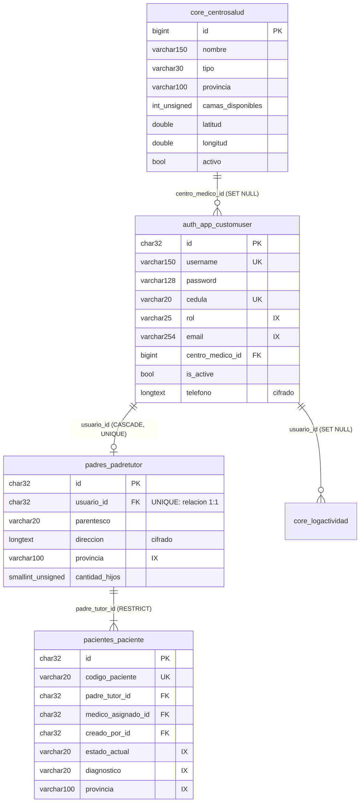
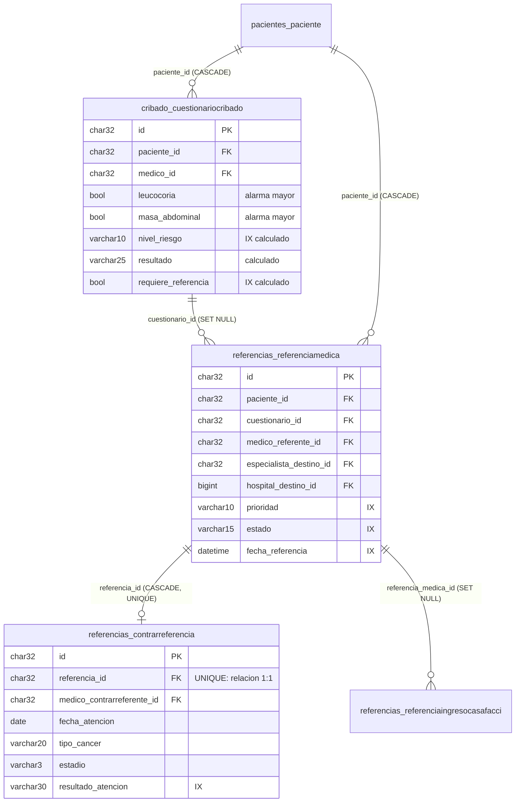
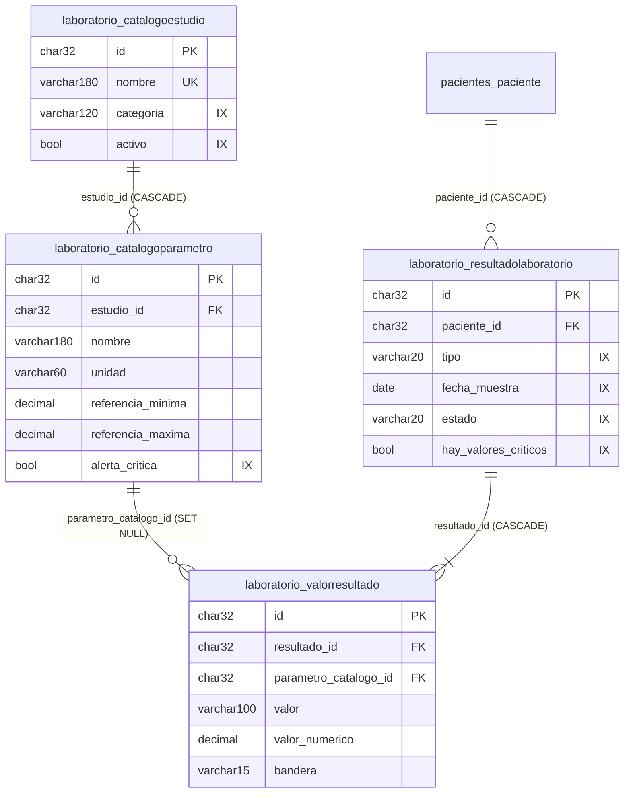
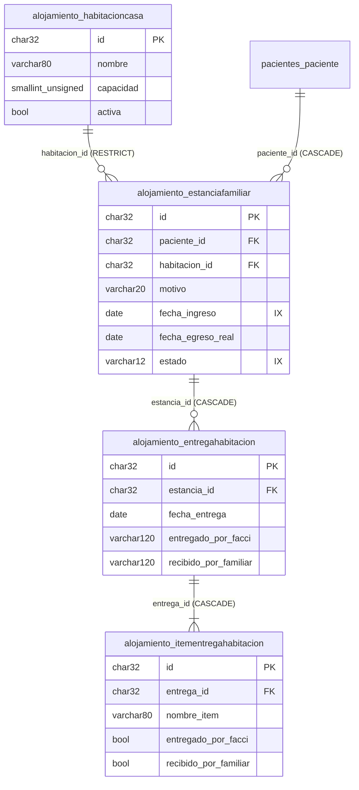
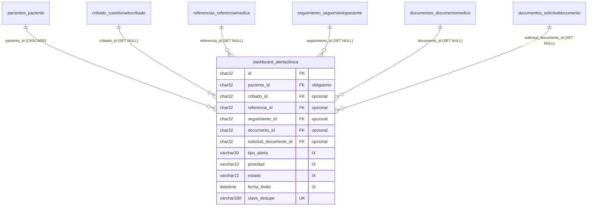

# Diagrama de Base de Datos — FACCI Care

**Esquema físico de la base de datos**
Fundación de Apoyo Contra el Cáncer Infantil (FACCI) — República Dominicana

| Campo | Detalle |
|---|---|
| **Tipo de entregable** | Diagrama de base de datos — nivel físico |
| **Versión del documento** | 1.0 |
| **Fecha de emisión** | Agosto 2026 |
| **Motor de desarrollo** | SQLite 3 |
| **Motor de producción** | MySQL 8 (`utf8mb4`, `STRICT_TRANS_TABLES`) |
| **Origen del esquema** | Generado por las migraciones de Django y verificado con `makemigrations --check` (sin cambios pendientes) |
| **Documentos relacionados** | `03-Modelo-de-Datos.md` (conceptual) · `05-Diccionario-Fisico-BD.md` (diccionario) |

---

## Tabla de contenido

1. [Alcance del documento](#1-alcance-del-documento)
2. [Resumen del esquema](#2-resumen-del-esquema)
3. [Inventario de tablas](#3-inventario-de-tablas)
4. [Diagrama físico global](#4-diagrama-físico-global)
5. [Diagramas físicos por subsistema](#5-diagramas-físicos-por-subsistema)
6. [Matriz completa de claves foráneas](#6-matriz-completa-de-claves-foráneas)
7. [Mapa de políticas de borrado](#7-mapa-de-políticas-de-borrado)
8. [Claves primarias](#8-claves-primarias)
9. [Restricciones de unicidad](#9-restricciones-de-unicidad)
10. [Inventario de índices](#10-inventario-de-índices)
11. [Tablas del framework](#11-tablas-del-framework)
12. [Correspondencia de tipos SQLite ↔ MySQL](#12-correspondencia-de-tipos-sqlite--mysql)
13. [Consideraciones de implantación](#13-consideraciones-de-implantación)
14. [Reproducción del esquema](#14-reproducción-del-esquema)

---

## 1. Alcance del documento

Este documento presenta **cómo está implementada físicamente la base de datos**: nombres reales de tablas y columnas clave, relaciones con sus políticas de borrado, claves primarias, restricciones e índices.

El esquema no se escribe a mano: lo genera el ORM de Django a partir de los modelos y sus migraciones. Todo lo que aquí se documenta fue extraído de una base de datos real construida aplicando las migraciones del repositorio, y contrastado con los modelos mediante `makemigrations --check`, que confirmó **«No changes detected»** — es decir, el esquema documentado corresponde exactamente al código fuente.

---

## 2. Resumen del esquema

| Métrica | Valor |
|---|---|
| Tablas propias de FACCI Care | **32** |
| Tablas del framework Django | 9 |
| **Total de tablas** | **41** |
| Columnas en tablas propias | **463** |
| Claves foráneas | **68** |
| Índices declarados | **182** |
| Restricciones UNIQUE simples | 11 |
| Restricciones UNIQUE compuestas | 1 |
| Relaciones uno a uno | 3 |
| Claves primarias UUID (`char(32)`) | 29 |
| Claves primarias enteras autoincrementales | 3 |

### 2.1 Convención de nombres

| Elemento | Convención | Ejemplo |
|---|---|---|
| Tabla | `{app}_{modelo en minúsculas}` | `pacientes_paciente` |
| Columna simple | Nombre del atributo en minúsculas | `codigo_paciente` |
| Columna de clave foránea | `{relación}_id` | `medico_asignado_id` |
| Índice explícito | `{concepto}_{campo}_idx` | `paciente_estado_idx` |
| Índice automático de FK | `{tabla}_{columna}_{hash}` | `pacientes_paciente_padre_tutor_id_b0e07e01` |

---

## 3. Inventario de tablas

| # | Tabla física | Módulo | Columnas | PK |
|---|---|---|---|---|
| 1 | `alojamiento_entregahabitacion` | Casa FACCI | 13 | UUID |
| 2 | `alojamiento_estanciafamiliar` | Casa FACCI | 15 | UUID |
| 3 | `alojamiento_habitacioncasa` | Casa FACCI | 5 | UUID |
| 4 | `alojamiento_itementregahabitacion` | Casa FACCI | 7 | UUID |
| 5 | `auth_app_customuser` | Seguridad | 20 | UUID |
| 6 | `casos_casoclinico` | Casos clínicos | 17 | UUID |
| 7 | `casos_notacaso` | Casos clínicos | 9 | UUID |
| 8 | `core_centrosalud` | Núcleo | 23 | Entero |
| 9 | `core_logactividad` | Núcleo | 11 | Entero |
| 10 | `core_sistemaconfiguracion` | Núcleo | 6 | Entero |
| 11 | `cribado_cuestionariocribado` | Cribado | 24 | UUID |
| 12 | `dashboard_alertaclinica` | Alertas | 19 | UUID |
| 13 | `documentos_documentomedico` | Documentos | 11 | UUID |
| 14 | `documentos_solicituddocumento` | Documentos | 9 | UUID |
| 15 | `laboratorio_catalogoestudio` | Laboratorio | 7 | UUID |
| 16 | `laboratorio_catalogoparametro` | Laboratorio | 16 | UUID |
| 17 | `laboratorio_resultadolaboratorio` | Laboratorio | 15 | UUID |
| 18 | `laboratorio_valorresultado` | Laboratorio | 13 | UUID |
| 19 | `notificaciones_notificacion` | Notificaciones | 18 | UUID |
| 20 | `pacientes_notaclinica` | Pacientes | 8 | UUID |
| 21 | `pacientes_paciente` | Pacientes | 25 | UUID |
| 22 | `padres_padretutor` | Familia | 15 | UUID |
| 23 | `padres_recursoeducativo` | Familia | 18 | UUID |
| 24 | `padres_registrotomamedicamento` | Familia | 7 | UUID |
| 25 | `padres_reportesintoma` | Familia | 8 | UUID |
| 26 | `psicosocial_evaluacionpsicosocial` | Psicosocial | 32 | UUID |
| 27 | `referencias_contrarreferencia` | Referencias | 16 | UUID |
| 28 | `referencias_referenciaingresocasafacci` | Referencias | 22 | UUID |
| 29 | `referencias_referenciamedica` | Referencias | 14 | UUID |
| 30 | `reportes_reportegenerado` | Reportes | 11 | UUID |
| 31 | `seguimiento_indicacionmedica` | Seguimiento | 11 | UUID |
| 32 | `seguimiento_seguimientopaciente` | Seguimiento | 18 | UUID |

### 3.1 Tablas por volumen de columnas

Las cinco tablas más anchas concentran la mayor densidad de información de negocio:

| Tabla | Columnas | Motivo |
|---|---|---|
| `psicosocial_evaluacionpsicosocial` | 32 | Instrumento de evaluación con múltiples factores de vulnerabilidad |
| `pacientes_paciente` | 25 | Ficha demográfica, clínica y administrativa del menor |
| `cribado_cuestionariocribado` | 24 | 13 signos booleanos más los resultados calculados |
| `core_centrosalud` | 23 | Ficha de capacidades, especialidades y geolocalización |
| `referencias_referenciaingresocasafacci` | 22 | Formulario oficial con datos completos del responsable |

---

## 4. Diagrama físico global

> Se muestran las columnas clave de cada tabla: identificador, claves foráneas y atributos determinantes. El detalle completo está en el diccionario físico.

```mermaid
erDiagram
    core_centrosalud ||--o{ auth_app_customuser : centro_medico_id
    core_centrosalud ||--o{ referencias_referenciamedica : hospital_destino_id
    core_centrosalud ||--o{ seguimiento_seguimientopaciente : lugar_seguimiento_id
    core_centrosalud ||--o{ referencias_referenciaingresocasafacci : centro_origen_id

    auth_app_customuser ||--o| padres_padretutor : usuario_id
    auth_app_customuser ||--o{ pacientes_paciente : medico_asignado_id
    auth_app_customuser ||--o{ cribado_cuestionariocribado : medico_id
    auth_app_customuser ||--o{ referencias_referenciamedica : medico_referente_id
    auth_app_customuser ||--o{ seguimiento_seguimientopaciente : medico_id
    auth_app_customuser ||--o{ seguimiento_indicacionmedica : medico_id
    auth_app_customuser ||--o{ documentos_documentomedico : subido_por_id
    auth_app_customuser ||--o{ notificaciones_notificacion : usuario_id
    auth_app_customuser ||--o{ core_logactividad : usuario_id
    auth_app_customuser ||--o{ reportes_reportegenerado : generado_por_id

    padres_padretutor ||--|{ pacientes_paciente : padre_tutor_id
    padres_padretutor ||--o{ padres_reportesintoma : tutor_id
    padres_padretutor ||--o{ padres_registrotomamedicamento : tutor_id

    pacientes_paciente ||--o{ pacientes_notaclinica : paciente_id
    pacientes_paciente ||--o{ cribado_cuestionariocribado : paciente_id
    pacientes_paciente ||--o{ referencias_referenciamedica : paciente_id
    pacientes_paciente ||--o{ seguimiento_seguimientopaciente : paciente_id
    pacientes_paciente ||--o{ seguimiento_indicacionmedica : paciente_id
    pacientes_paciente ||--o{ documentos_documentomedico : paciente_id
    pacientes_paciente ||--o{ documentos_solicituddocumento : paciente_id
    pacientes_paciente ||--o{ laboratorio_resultadolaboratorio : paciente_id
    pacientes_paciente ||--o{ psicosocial_evaluacionpsicosocial : paciente_id
    pacientes_paciente ||--o{ alojamiento_estanciafamiliar : paciente_id
    pacientes_paciente ||--o{ padres_reportesintoma : paciente_id
    pacientes_paciente ||--o{ padres_registrotomamedicamento : paciente_id
    pacientes_paciente ||--o{ dashboard_alertaclinica : paciente_id
    pacientes_paciente ||--o{ casos_casoclinico : paciente_id
    pacientes_paciente ||--o{ referencias_referenciaingresocasafacci : paciente_id

    cribado_cuestionariocribado ||--o{ referencias_referenciamedica : cuestionario_id
    cribado_cuestionariocribado ||--o{ casos_casoclinico : cribado_origen_id
    cribado_cuestionariocribado ||--o{ dashboard_alertaclinica : cribado_id

    referencias_referenciamedica ||--o| referencias_contrarreferencia : referencia_id
    referencias_referenciamedica ||--o{ referencias_referenciaingresocasafacci : referencia_medica_id
    referencias_referenciamedica ||--o{ dashboard_alertaclinica : referencia_id

    seguimiento_seguimientopaciente ||--o{ dashboard_alertaclinica : seguimiento_id

    casos_casoclinico ||--o{ casos_notacaso : caso_id

    laboratorio_catalogoestudio ||--o{ laboratorio_catalogoparametro : estudio_id
    laboratorio_catalogoparametro ||--o{ laboratorio_valorresultado : parametro_catalogo_id
    laboratorio_resultadolaboratorio ||--|{ laboratorio_valorresultado : resultado_id

    alojamiento_habitacioncasa ||--o{ alojamiento_estanciafamiliar : habitacion_id
    alojamiento_habitacioncasa ||--o{ referencias_referenciaingresocasafacci : habitacion_id
    alojamiento_estanciafamiliar ||--o{ alojamiento_entregahabitacion : estancia_id
    alojamiento_entregahabitacion ||--|{ alojamiento_itementregahabitacion : entrega_id

    documentos_documentomedico ||--o| documentos_solicituddocumento : documento_asociado_id
    documentos_documentomedico ||--o{ dashboard_alertaclinica : documento_id
    documentos_solicituddocumento ||--o{ dashboard_alertaclinica : solicitud_documento_id
```



---

## 5. Diagramas físicos por subsistema

### 5.1 Seguridad, núcleo y familia



### 5.2 Ruta clínica: cribado → referencia → contrarreferencia



### 5.3 Laboratorio (catálogo maestro y resultados)



### 5.4 Casa FACCI (cadena de composición)



**Nota de diseño:** `alojamiento_habitacioncasa` usa política **RESTRICT** (PROTECT en el ORM): una habitación con estancias registradas no puede eliminarse. Esto implementa a nivel de base de datos la regla operativa descrita en el manual de usuario.

### 5.5 Alertas clínicas: tabla con múltiples orígenes opcionales



Esta tabla concentra **12 índices de clave foránea** y 5 índices explícitos: es la más indexada del esquema, por ser la que se consulta con más combinaciones de filtros en el tablero de alertas.

---

## 6. Matriz completa de claves foráneas

Las 68 relaciones del esquema, ordenadas por tabla de origen.

| Tabla origen | Columna | Tabla destino | Columna | ON DELETE |
|---|---|---|---|---|
| `alojamiento_entregahabitacion` | `estancia_id` | `alojamiento_estanciafamiliar` | `id` | CASCADE |
| `alojamiento_entregahabitacion` | `creado_por_id` | `auth_app_customuser` | `id` | SET NULL |
| `alojamiento_estanciafamiliar` | `paciente_id` | `pacientes_paciente` | `id` | CASCADE |
| `alojamiento_estanciafamiliar` | `habitacion_id` | `alojamiento_habitacioncasa` | `id` | RESTRICT |
| `alojamiento_estanciafamiliar` | `registrado_por_id` | `auth_app_customuser` | `id` | RESTRICT |
| `alojamiento_itementregahabitacion` | `entrega_id` | `alojamiento_entregahabitacion` | `id` | CASCADE |
| `auth_app_customuser` | `centro_medico_id` | `core_centrosalud` | `id` | SET NULL |
| `casos_casoclinico` | `paciente_id` | `pacientes_paciente` | `id` | CASCADE |
| `casos_casoclinico` | `medico_responsable_id` | `auth_app_customuser` | `id` | RESTRICT |
| `casos_casoclinico` | `creado_por_id` | `auth_app_customuser` | `id` | SET NULL |
| `casos_casoclinico` | `cribado_origen_id` | `cribado_cuestionariocribado` | `id` | SET NULL |
| `casos_notacaso` | `caso_id` | `casos_casoclinico` | `id` | CASCADE |
| `casos_notacaso` | `autor_id` | `auth_app_customuser` | `id` | RESTRICT |
| `core_logactividad` | `usuario_id` | `auth_app_customuser` | `id` | SET NULL |
| `cribado_cuestionariocribado` | `paciente_id` | `pacientes_paciente` | `id` | CASCADE |
| `cribado_cuestionariocribado` | `medico_id` | `auth_app_customuser` | `id` | RESTRICT |
| `dashboard_alertaclinica` | `paciente_id` | `pacientes_paciente` | `id` | CASCADE |
| `dashboard_alertaclinica` | `cribado_id` | `cribado_cuestionariocribado` | `id` | SET NULL |
| `dashboard_alertaclinica` | `referencia_id` | `referencias_referenciamedica` | `id` | SET NULL |
| `dashboard_alertaclinica` | `seguimiento_id` | `seguimiento_seguimientopaciente` | `id` | SET NULL |
| `dashboard_alertaclinica` | `documento_id` | `documentos_documentomedico` | `id` | SET NULL |
| `dashboard_alertaclinica` | `solicitud_documento_id` | `documentos_solicituddocumento` | `id` | SET NULL |
| `dashboard_alertaclinica` | `revisado_por_id` | `auth_app_customuser` | `id` | SET NULL |
| `documentos_documentomedico` | `paciente_id` | `pacientes_paciente` | `id` | CASCADE |
| `documentos_documentomedico` | `subido_por_id` | `auth_app_customuser` | `id` | RESTRICT |
| `documentos_solicituddocumento` | `paciente_id` | `pacientes_paciente` | `id` | CASCADE |
| `documentos_solicituddocumento` | `medico_solicitante_id` | `auth_app_customuser` | `id` | RESTRICT |
| `documentos_solicituddocumento` | `documento_asociado_id` | `documentos_documentomedico` | `id` | SET NULL |
| `laboratorio_catalogoparametro` | `estudio_id` | `laboratorio_catalogoestudio` | `id` | CASCADE |
| `laboratorio_resultadolaboratorio` | `paciente_id` | `pacientes_paciente` | `id` | CASCADE |
| `laboratorio_resultadolaboratorio` | `solicitado_por_id` | `auth_app_customuser` | `id` | SET NULL |
| `laboratorio_resultadolaboratorio` | `revisado_por_id` | `auth_app_customuser` | `id` | SET NULL |
| `laboratorio_valorresultado` | `resultado_id` | `laboratorio_resultadolaboratorio` | `id` | CASCADE |
| `laboratorio_valorresultado` | `parametro_catalogo_id` | `laboratorio_catalogoparametro` | `id` | SET NULL |
| `notificaciones_notificacion` | `usuario_id` | `auth_app_customuser` | `id` | CASCADE |
| `notificaciones_notificacion` | `content_type_id` | `django_content_type` | `id` | SET NULL |
| `pacientes_notaclinica` | `paciente_id` | `pacientes_paciente` | `id` | CASCADE |
| `pacientes_notaclinica` | `autor_id` | `auth_app_customuser` | `id` | RESTRICT |
| `pacientes_paciente` | `padre_tutor_id` | `padres_padretutor` | `id` | RESTRICT |
| `pacientes_paciente` | `medico_asignado_id` | `auth_app_customuser` | `id` | SET NULL |
| `pacientes_paciente` | `creado_por_id` | `auth_app_customuser` | `id` | SET NULL |
| `padres_padretutor` | `usuario_id` | `auth_app_customuser` | `id` | CASCADE |
| `padres_registrotomamedicamento` | `paciente_id` | `pacientes_paciente` | `id` | CASCADE |
| `padres_registrotomamedicamento` | `tutor_id` | `padres_padretutor` | `id` | SET NULL |
| `padres_reportesintoma` | `paciente_id` | `pacientes_paciente` | `id` | CASCADE |
| `padres_reportesintoma` | `tutor_id` | `padres_padretutor` | `id` | SET NULL |
| `psicosocial_evaluacionpsicosocial` | `paciente_id` | `pacientes_paciente` | `id` | CASCADE |
| `psicosocial_evaluacionpsicosocial` | `evaluador_id` | `auth_app_customuser` | `id` | SET NULL |
| `referencias_contrarreferencia` | `referencia_id` | `referencias_referenciamedica` | `id` | CASCADE |
| `referencias_contrarreferencia` | `medico_contrarreferente_id` | `auth_app_customuser` | `id` | RESTRICT |
| `referencias_referenciaingresocasafacci` | `paciente_id` | `pacientes_paciente` | `id` | CASCADE |
| `referencias_referenciaingresocasafacci` | `referencia_medica_id` | `referencias_referenciamedica` | `id` | SET NULL |
| `referencias_referenciaingresocasafacci` | `centro_origen_id` | `core_centrosalud` | `id` | SET NULL |
| `referencias_referenciaingresocasafacci` | `hospital_destino_id` | `core_centrosalud` | `id` | SET NULL |
| `referencias_referenciaingresocasafacci` | `habitacion_id` | `alojamiento_habitacioncasa` | `id` | SET NULL |
| `referencias_referenciaingresocasafacci` | `creado_por_id` | `auth_app_customuser` | `id` | SET NULL |
| `referencias_referenciamedica` | `paciente_id` | `pacientes_paciente` | `id` | CASCADE |
| `referencias_referenciamedica` | `cuestionario_id` | `cribado_cuestionariocribado` | `id` | SET NULL |
| `referencias_referenciamedica` | `medico_referente_id` | `auth_app_customuser` | `id` | RESTRICT |
| `referencias_referenciamedica` | `especialista_destino_id` | `auth_app_customuser` | `id` | SET NULL |
| `referencias_referenciamedica` | `hospital_destino_id` | `core_centrosalud` | `id` | RESTRICT |
| `reportes_reportegenerado` | `generado_por_id` | `auth_app_customuser` | `id` | RESTRICT |
| `seguimiento_indicacionmedica` | `paciente_id` | `pacientes_paciente` | `id` | CASCADE |
| `seguimiento_indicacionmedica` | `medico_id` | `auth_app_customuser` | `id` | RESTRICT |
| `seguimiento_seguimientopaciente` | `paciente_id` | `pacientes_paciente` | `id` | CASCADE |
| `seguimiento_seguimientopaciente` | `medico_id` | `auth_app_customuser` | `id` | RESTRICT |
| `seguimiento_seguimientopaciente` | `medico_seguimiento_id` | `auth_app_customuser` | `id` | SET NULL |
| `seguimiento_seguimientopaciente` | `lugar_seguimiento_id` | `core_centrosalud` | `id` | SET NULL |

> **Nota sobre RESTRICT.** En los modelos esta política se declara como `PROTECT`. Django la valida en la capa de aplicación y, en el esquema físico, la clave foránea se crea con la restricción de integridad correspondiente. El efecto para el operador es el mismo: la eliminación se rechaza.

### 6.1 Tablas más referenciadas

| Tabla | Veces referenciada | Papel en el esquema |
|---|---|---|
| `auth_app_customuser` | 26 | Autoría y responsabilidad de todos los actos |
| `pacientes_paciente` | 15 | Eje del expediente clínico |
| `core_centrosalud` | 5 | Catálogo institucional transversal |
| `cribado_cuestionariocribado` | 3 | Origen clínico de referencias y casos |
| `referencias_referenciamedica` | 3 | Nodo de la ruta de derivación |
| `padres_padretutor` | 3 | Responsable familiar del paciente |
| `documentos_documentomedico` | 2 | Expediente digital |
| `alojamiento_habitacioncasa` | 2 | Recurso físico de la Casa FACCI |
| Resto (9 tablas) | 1 cada una | Relaciones de composición y catálogos |

---

## 7. Mapa de políticas de borrado

```
                    ┌────────────────────────────────────────┐
                    │      auth_app_customuser (USUARIO)     │
                    └───┬────────────────┬───────────────┬───┘
          RESTRICT ─────┘        SET NULL│               └───── CASCADE
   (no se puede borrar         (el vínculo se anula)   (se borra en cascada)
    un usuario con actos                                        │
    clínicos registrados)                                       ▼
          │                                        padres_padretutor
          ▼                                        notificaciones_notificacion
   cribado · referencias · contrarreferencia
   seguimientos · indicaciones · notas
   documentos · solicitudes · reportes
   estancias · casos


                    ┌────────────────────────────────────────┐
                    │      pacientes_paciente (PACIENTE)      │
                    └────────────────────┬───────────────────┘
                                CASCADE  │  (15 tablas hijas)
                                         ▼
   cribados · referencias · seguimientos · indicaciones · notas clínicas
   documentos · solicitudes · resultados de laboratorio · evaluaciones
   estancias · reportes de síntomas · alertas · casos · ingresos Casa FACCI
   registros de toma de medicamento


                    ┌────────────────────────────────────────┐
                    │        padres_padretutor (TUTOR)        │
                    └───┬────────────────────────────────┬───┘
              RESTRICT ─┘                                └─ SET NULL
   pacientes_paciente                          reportes de síntomas,
   (un tutor con pacientes                     registros de medicamento
    no puede eliminarse)
```

**Lectura operativa del mapa:**

1. **Ningún dato clínico queda huérfano de responsable:** las relaciones de autoría son RESTRICT.
2. **Al eliminar un paciente se elimina todo su expediente:** las 15 tablas hijas son CASCADE. Es una operación irreversible que debe reservarse a casos excepcionales y realizarse con respaldo previo.
3. **Los vínculos de contexto sobreviven a la desaparición de su referencia:** un seguimiento no se pierde si se elimina el centro de salud donde se realizó; solo queda sin lugar asociado.

---

## 8. Claves primarias

### 8.1 Tablas con clave primaria UUID (29)

Almacenada como `char(32)` — el UUID sin guiones. Se genera en la aplicación con UUID versión 4 antes de la inserción.

`alojamiento_entregahabitacion` · `alojamiento_estanciafamiliar` · `alojamiento_habitacioncasa` · `alojamiento_itementregahabitacion` · `auth_app_customuser` · `casos_casoclinico` · `casos_notacaso` · `cribado_cuestionariocribado` · `dashboard_alertaclinica` · `documentos_documentomedico` · `documentos_solicituddocumento` · `laboratorio_catalogoestudio` · `laboratorio_catalogoparametro` · `laboratorio_resultadolaboratorio` · `laboratorio_valorresultado` · `notificaciones_notificacion` · `pacientes_notaclinica` · `pacientes_paciente` · `padres_padretutor` · `padres_recursoeducativo` · `padres_registrotomamedicamento` · `padres_reportesintoma` · `psicosocial_evaluacionpsicosocial` · `referencias_contrarreferencia` · `referencias_referenciaingresocasafacci` · `referencias_referenciamedica` · `reportes_reportegenerado` · `seguimiento_indicacionmedica` · `seguimiento_seguimientopaciente`

### 8.2 Tablas con clave primaria entera (3)

| Tabla | Tipo | Justificación |
|---|---|---|
| `core_centrosalud` | `bigint AUTO_INCREMENT` | Catálogo interno, sin exposición en URL pública |
| `core_logactividad` | `bigint AUTO_INCREMENT` | Bitácora de alto volumen; el entero es más compacto y ordena por inserción |
| `core_sistemaconfiguracion` | `bigint AUTO_INCREMENT` | Tabla de registro único (siempre `id = 1`) |

---

## 9. Restricciones de unicidad

### 9.1 Unicidad simple

| Tabla | Columna | Propósito |
|---|---|---|
| `auth_app_customuser` | `username` | Credencial de acceso |
| `auth_app_customuser` | `cedula` | Identidad legal (admite nulo) |
| `pacientes_paciente` | `codigo_paciente` | Identificador operativo del caso |
| `casos_casoclinico` | `codigo_caso` | Identificador del caso oncológico |
| `laboratorio_catalogoestudio` | `nombre` | Evita duplicar estudios del maestro |
| `padres_recursoeducativo` | `slug` | Direccionamiento único del recurso |
| `dashboard_alertaclinica` | `clave_dedupe` | Impide alertas repetidas del mismo hecho |
| `notificaciones_notificacion` | `clave_dedupe` | Impide notificaciones repetidas |
| `referencias_contrarreferencia` | `referencia_id` | Materializa la relación 1:1 |
| `padres_padretutor` | `usuario_id` | Materializa la relación 1:1 |
| `documentos_solicituddocumento` | `documento_asociado_id` | Materializa la relación 1:1 |

### 9.2 Unicidad compuesta

| Tabla | Columnas | Nombre de la restricción |
|---|---|---|
| `padres_registrotomamedicamento` | (`paciente_id`, `nombre_medicamento`, `indice`, `fecha`) | `padres_registrotomamedicamento_paciente_id_nombre_medicamento_indice_fecha_0a689286_uniq` |

Esta restricción impide que la familia marque dos veces la misma dosis del mismo medicamento en el mismo día.

---

## 10. Inventario de índices

El esquema declara **182 índices**, de tres naturalezas:

| Naturaleza | Cantidad | Origen |
|---|---|---|
| **Índices de negocio** (`Meta.indexes`) | 68 | Declarados explícitamente para acelerar los filtros y ordenamientos de cada módulo; llevan nombre propio terminado en `_idx` |
| **Índices de clave foránea** | 66 | Creados automáticamente para cada relación, con nombre generado |
| **Índices de columna** (`db_index=True`) | 48 | Columnas marcadas como indexadas en el modelo sin formar parte de `Meta.indexes` |

### 10.1 Distribución por tabla

En la tabla siguiente, «índices de negocio» corresponde a los declarados en `Meta.indexes` y «otros índices» agrupa los de clave foránea y los de columna.

| Tabla | Columnas | Índices de negocio | Otros índices |
|---|---|---|---|
| `alojamiento_entregahabitacion` | 13 | 0 | 2 |
| `alojamiento_estanciafamiliar` | 15 | 3 | 4 |
| `alojamiento_habitacioncasa` | 5 | 0 | 0 |
| `alojamiento_itementregahabitacion` | 7 | 0 | 1 |
| `auth_app_customuser` | 20 | 3 | 2 |
| `casos_casoclinico` | 17 | 6 | 7 |
| `casos_notacaso` | 9 | 3 | 3 |
| `core_centrosalud` | 23 | 0 | 0 |
| `core_logactividad` | 11 | 3 | 3 |
| `core_sistemaconfiguracion` | 6 | 0 | 0 |
| `cribado_cuestionariocribado` | 24 | 5 | 4 |
| `dashboard_alertaclinica` | 19 | 5 | 12 |
| `documentos_documentomedico` | 11 | 3 | 5 |
| `documentos_solicituddocumento` | 9 | 0 | 3 |
| `laboratorio_catalogoestudio` | 7 | 0 | 2 |
| `laboratorio_catalogoparametro` | 16 | 2 | 4 |
| `laboratorio_resultadolaboratorio` | 15 | 2 | 7 |
| `laboratorio_valorresultado` | 13 | 0 | 3 |
| `notificaciones_notificacion` | 18 | 10 | 7 |
| `pacientes_notaclinica` | 8 | 3 | 3 |
| `pacientes_paciente` | 25 | 4 | 5 |
| `padres_padretutor` | 15 | 1 | 0 |
| `padres_recursoeducativo` | 18 | 1 | 0 |
| `padres_registrotomamedicamento` | 7 | 1 | 4 |
| `padres_reportesintoma` | 8 | 0 | 2 |
| `psicosocial_evaluacionpsicosocial` | 32 | 1 | 5 |
| `referencias_contrarreferencia` | 16 | 0 | 2 |
| `referencias_referenciaingresocasafacci` | 22 | 3 | 7 |
| `referencias_referenciamedica` | 14 | 3 | 8 |
| `reportes_reportegenerado` | 11 | 3 | 3 |
| `seguimiento_indicacionmedica` | 11 | 0 | 2 |
| `seguimiento_seguimientopaciente` | 18 | 3 | 4 |

### 10.2 Índices explícitos por finalidad

| Finalidad | Ejemplos de índices |
|---|---|
| **Filtrado de listados por estado** | `paciente_estado_idx` · `referencia_estado_idx` · `ingreso_casa_estado_idx` |
| **Búsqueda por identificador de negocio** | `paciente_codigo_idx` · `customuser_cedula_idx` |
| **Filtrado por rol y correo (autenticación)** | `customuser_rol_idx` · `customuser_email_idx` |
| **Ordenamiento cronológico** | `cribado_fecha_idx` · `nota_fecha_idx` · `logactividad_fecha_idx` · `seguimiento_fecha_idx` |
| **Priorización clínica** | `cribado_nivel_idx` · `referencia_prioridad_idx` · `cribado_referencia_idx` |
| **Distribución geográfica (reportes)** | `paciente_provincia_idx` · `padretutor_provincia_idx` |
| **Auditoría** | `logactividad_tipo_idx` · `logactividad_modulo_idx` |
| **Detección de valores críticos** | `alerta_critica` e índices de estado en laboratorio |
| **Índices compuestos** | `recurso_activo_cat_idx` (activo + categoría) · `regtoma_paciente_fecha_idx` (paciente + fecha) |

---

## 11. Tablas del framework

Además de las 32 tablas propias, el esquema incluye 9 tablas gestionadas por Django. **No deben modificarse manualmente.**

| Tabla | Función |
|---|---|
| `django_migrations` | Registro de las migraciones aplicadas |
| `django_content_type` | Catálogo de tipos de modelo; usado por las notificaciones para su vínculo genérico |
| `django_session` | Sesiones activas de usuario |
| `django_admin_log` | Bitácora de acciones realizadas en el panel Django Admin |
| `auth_permission` | Catálogo de permisos del framework |
| `auth_group` | Grupos de permisos |
| `auth_group_permissions` | Relación grupo ↔ permiso |
| `auth_app_customuser_groups` | Relación usuario ↔ grupo |
| `auth_app_customuser_user_permissions` | Relación usuario ↔ permiso individual |

> **Importante:** FACCI Care **no utiliza** los grupos y permisos del framework para su lógica de autorización. El control de acceso se basa exclusivamente en el atributo `rol` de `auth_app_customuser` y en la matriz de permisos implementada en el modelo de usuario. Las tablas `auth_group*` y `auth_permission` existen porque Django las requiere y solo intervienen en el panel Django Admin.

---

## 12. Correspondencia de tipos SQLite ↔ MySQL

El mismo modelo produce tipos distintos según el motor. Esta tabla permite leer el diccionario físico en cualquiera de los dos entornos.

| Tipo del modelo | SQLite (desarrollo) | MySQL 8 (producción) | Observación |
|---|---|---|---|
| `UUIDField` | `char(32)` | `char(32)` | UUID sin guiones |
| `BigAutoField` | `INTEGER` (rowid) | `bigint AUTO_INCREMENT` | Clave primaria entera |
| `CharField(n)` | `varchar(n)` | `varchar(n)` | |
| `TextField` | `TEXT` | `longtext` | |
| `EmailField` | `varchar(254)` | `varchar(254)` | |
| `SlugField(n)` | `varchar(n)` | `varchar(n)` | |
| `URLField(n)` | `varchar(n)` | `varchar(n)` | |
| `BooleanField` | `bool` | `bool` (`tinyint(1)`) | |
| `IntegerField` | `integer` | `integer` | |
| `PositiveIntegerField` | `integer unsigned` | `integer UNSIGNED` | |
| `PositiveSmallIntegerField` | `smallint unsigned` | `smallint UNSIGNED` | |
| `DecimalField(m,d)` | `decimal` | `numeric(m, d)` | SQLite no impone precisión |
| `FloatField` | `REAL` | `double precision` | |
| `DateField` | `date` | `date` | |
| `DateTimeField` | `datetime` | `datetime(6)` | MySQL con precisión de microsegundos |
| `TimeField` | `time` | `time(6)` | |
| `JSONField` | `TEXT` | `json` | MySQL valida la estructura JSON |
| `FileField` / `ImageField` | `varchar(100)` | `varchar(100)` | Almacena la **ruta**, no el archivo |
| `GenericIPAddressField` | `char(39)` | `char(39)` | Compatible con IPv6 |

### 12.1 Diferencias operativas relevantes

| Aspecto | SQLite | MySQL |
|---|---|---|
| Tipado | Dinámico por afinidad; no impone longitudes | Estricto (`STRICT_TRANS_TABLES`) |
| Juego de caracteres | UTF-8 nativo | `utf8mb4` (requerido para acentos y emojis) |
| Precisión temporal | Segundos | Microsegundos |
| Validación JSON | No | Sí |
| Concurrencia de escritura | Bloqueo de archivo completo | Bloqueo por fila (InnoDB) |
| Uso recomendado | Desarrollo y pruebas | Producción |

> **Los archivos no se almacenan en la base de datos.** Las columnas `FileField` e `ImageField` guardan una ruta relativa de hasta 100 caracteres; el contenido reside en `MEDIA_ROOT`. Cualquier plan de respaldo debe cubrir **base de datos y directorio de medios de forma conjunta**, o el expediente quedará incompleto.

---

## 13. Consideraciones de implantación

### 13.1 Configuración de MySQL

El sistema aplica automáticamente estas opciones cuando el motor es MySQL:

```
charset      = utf8mb4
init_command = SET sql_mode='STRICT_TRANS_TABLES'
```

`utf8mb4` es indispensable para almacenar correctamente nombres con acentos y la letra ñ.

### 13.2 Dimensionamiento

| Tabla | Crecimiento esperado | Observación |
|---|---|---|
| `core_logactividad` | **Alto y continuo** | Crece con cada acción del sistema. Requiere política de archivado o purga periódica |
| `notificaciones_notificacion` | Alto | Dispone de marca `archivada` para depuración |
| `laboratorio_valorresultado` | Alto | Varias filas por cada resultado de laboratorio |
| `dashboard_alertaclinica` | Medio | Controlado por la clave de deduplicación |
| `pacientes_paciente` y tablas clínicas | Moderado | Ligado al volumen real de casos |
| Catálogos (`core_centrosalud`, `laboratorio_catalogoestudio`, `padres_recursoeducativo`) | Bajo | Mantenimiento manual |

### 13.3 Respaldo y recuperación

1. Respalde **siempre en conjunto** la base de datos y el directorio `MEDIA_ROOT`.
2. Custodie la clave `FACCI_ENCRYPTION_KEY` **fuera del servidor**: sin ella, los siete atributos cifrados son irrecuperables aunque el respaldo de la base esté íntegro.
3. Verifique periódicamente la restauración en un entorno de prueba; un respaldo no verificado no es un respaldo.

### 13.4 Atributos cifrados y consulta

Los siguientes atributos se almacenan cifrados y, en consecuencia, **no admiten filtrado, ordenamiento ni búsqueda parcial en SQL**:

| Tabla | Columnas cifradas |
|---|---|
| `auth_app_customuser` | `telefono` |
| `pacientes_paciente` | `direccion` · `alergias` · `antecedentes_medicos` |
| `padres_padretutor` | `direccion` · `contacto_emergencia` · `telefono_emergencia` |

Cualquier consulta directa sobre la base devolverá el texto cifrado con prefijo `enc:`. El descifrado ocurre exclusivamente en la capa de aplicación.

---

## 14. Reproducción del esquema

El esquema físico documentado puede regenerarse íntegramente desde el código fuente:

```bash
# Crear la base de datos con todo el esquema
python manage.py migrate

# Verificar que el esquema corresponde a los modelos (debe responder "No changes detected")
python manage.py makemigrations --check --dry-run

# Ver el SQL que genera una migración concreta, sin ejecutarlo
python manage.py sqlmigrate pacientes 0001_initial

# Inspeccionar el esquema en SQLite
sqlite3 db.sqlite3 ".schema pacientes_paciente"
sqlite3 db.sqlite3 ".tables"

# Inspeccionar el esquema en MySQL
mysql -u <usuario> -p -e "SHOW CREATE TABLE pacientes_paciente\G" <base>
mysql -u <usuario> -p -e "SHOW TABLES;" <base>
```

**Procedimiento de verificación aplicado para este documento:**

1. Se creó una base de datos vacía y se aplicaron todas las migraciones del repositorio.
2. Se ejecutó `makemigrations --check --dry-run`, que confirmó ausencia de cambios pendientes.
3. Se extrajo el esquema resultante mediante introspección (`PRAGMA table_info` y `PRAGMA index_list`) y se cruzó con los metadatos de los modelos.
4. Los conteos de tablas, columnas, claves foráneas e índices de este documento provienen de esa extracción.

> **Nota metodológica.** La verificación se realizó con Django 5.2, versión disponible en el entorno de trabajo; el proyecto declara Django 6.0.5 en `requirements.txt`. Ambas versiones generan el mismo esquema para los modelos de FACCI Care, ya que ninguno emplea funcionalidades de esquema introducidas en la versión 6. Se recomienda repetir la verificación en el entorno definitivo de despliegue.

---

*Fin del documento — Diagrama de Base de Datos FACCI Care, versión 1.0.*
